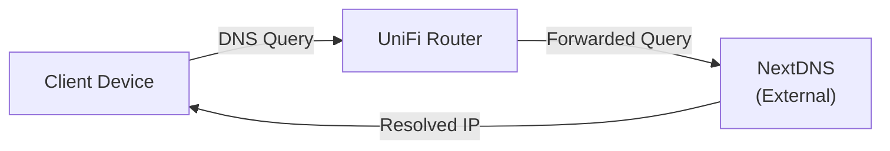

# DNS Strategy

This document outlines the DNS strategy for the homelab network. All DNS resolution is handled by NextDNS as the upstream provider for ad-blocking and privacy, with public domains managed via Cloudflare.

## DNS Resolution Flow

All clients use the Unifi router as their DNS server, which forwards all queries to NextDNS.



The resolution path is as follows:
1. **Client Device** sends a DNS query to the Unifi router (`.1` on their subnet).
2. The router forwards the query to **NextDNS** for resolution, which provides ad-blocking and privacy filtering.

## Unifi Router as DNS Server

Each network uses its gateway as the DNS server:

| Network | DNS Server |
|---------|------------|
| Default (192.168.1.0/24) | `192.168.1.1` |
| USER (10.0.10.0/24) | `10.0.10.1` |
| IOT (10.0.20.0/24) | `10.0.20.1` |
| DEV-INFRA (10.0.30.0/24) | `10.0.30.1` |
| PROD-INFRA (10.0.40.0/24) | `10.0.40.1` |
| GUEST (10.0.80.0/24) | `10.0.80.1` |

## Upstream DNS (NextDNS)

The Unifi router is configured to forward external DNS queries to **NextDNS**, a cloud-based DNS service that provides:

- **Ad-blocking**: Network-wide advertisement filtering
- **Privacy**: Tracker blocking and encrypted DNS
- **Security**: Malware and phishing protection
- **Analytics**: Query logging and insights (optional)

NextDNS is configured in the UDM-PRO under **Settings → Internet → WAN → DNS Server**.

## Public DNS

Public DNS is managed through Cloudflare for two separate domains, with traffic routed via Cloudflare Tunnels.

- **`krapulax.dev`**: Used for the media server stack.
- **`krapulax.net`**: Used for the Docker Swarm cluster and other infrastructure services.


## Verification

To verify DNS resolution is working correctly, you can test external resolution, which should show NextDNS filtering:

```sh
dig @10.0.40.1 example.com
```
