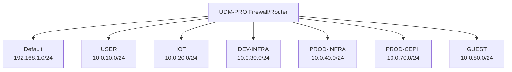

# Network Documentation

This document describes the network setup in the homelab. The network architecture aims to use K.I.S.S. principles. The central point of the system is the Unifi-based firewall and switch, managed as code via Terraform.

## Networks

The following networks are present. VLAN IDs correspond to the third octet of the subnet.

| VLAN id | Network Name | Subnet CIDR    | Description                                 | DNS Server         | FW Rules    |
| ------- | ------------ | -------------- | ------------------------------------------- | ------------------ | ----------- |
| 1       | Default      | 192.168.1.0/24 | Management LAN (Unifi Devices)              | `192.168.1.1`      | Allow All   |
| 10      | USER         | 10.0.10.0/24   | Trusted devices (Laptops, Phones)           | `10.0.10.1`        | Allow All   |
| 20      | IOT          | 10.0.20.0/24   | IoT Devices                                 | `10.0.20.1`        | Isolated    |
| 30      | DEV-INFRA    | 10.0.30.0/24   | Development Infrastructure (Docker Swarm)  | `10.0.30.1`        | Restricted  |
| 40      | PROD-INFRA   | 10.0.40.0/24   | Production Infrastructure                   | `10.0.40.1`        | Restricted  |
| 70      | PROD-CEPH    | 10.0.70.0/24   | Dedicated Ceph Storage Cluster Network      | -                  | No Internet |
| 80      | GUEST        | 10.0.80.0/24   | Guest Network                               | `10.0.80.1`        | Isolated    |

> **Note**: All networks use the Unifi router as DNS resolver (`.1` on each subnet). The router forwards external queries to NextDNS.

## Virtual Private Networks (VPNs)

### Tailscale

For a detailed overview of the Tailscale setup, see the [Tailscale Configuration](tools/tailscale.md) document.

Tailscale creates a virtual private network that connects devices directly.

*   **DNS**: Tailscale is configured to use NextDNS as its global resolver.

## Network Diagram

## DNS Strategy

For a comprehensive overview of the DNS configuration, see the [DNS Strategy](dns.md) document.

### DNS Resolution

All networks use the **Unifi router** (`.1` on each subnet) as the DNS server provided via DHCP. The router handles:
- All queries are forwarded to **NextDNS** for ad-blocking, privacy, and security filtering.

### Domain Resolution

* **Public**: `krapulax.dev` and `krapulax.net` (Managed by Cloudflare)
