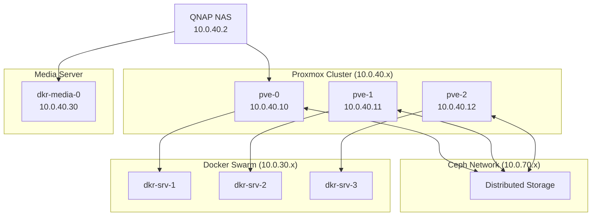

# Homelab Architecture Documentation

Welcome to the documentation for my homelab setup. This repository contains detailed documentation of the physical and virtual infrastructure, network configurations, and services running in the homelab environment.

## My aim and key principles are

1. `Automation` and `Infrastructure-as-Code` first
2. While I think complexity is unavoidable, I try to use `K.I.S.S` principles
3. The deployments heavily utilise tools such as `Ansible`, `Docker`, `Terraform`
4. For management of secrets, there are multiple approaches based on context:
   1. `Doppler` preferred (still migrating secrets to this)
   2. `1password` (for browser plugin)
   3. Environment files (phasing out these in favour of Doppler)
5. I favour using open source tools and free tools, but if needed, I am happy to pay for software or services with a fairly limited budget

## Architecture Overview

## Contents

- [Network](docs/network.md) - Detailed network design, including VLANs, subnets, and firewall rules.
- [Hardware](docs/hardware.md) - An overview of the physical servers and network gear.
- [Services](docs/services.md) - A list of services running in the homelab.
- [DNS Strategy](docs/dns.md) - The DNS resolution strategy for the network.
- [Architecture Decisions](docs/architecture-decisions.md) - Record of architectural decisions and future roadmap.
- [Tools](docs/tools.md) - Some tools of importance / complexity that validates mentioning
- [Repositories](docs/repositories.md) - List of IaC repositories managing this infrastructure

## Key Technologies

| Component | Technology | Repository |
|-----------|------------|------------|
| **Virtualization** | Proxmox VE | `ansible/infra-ansible-home-proxmoxhosts` |
| **Container Orchestration** | Docker Swarm | `project-dockerlab` |
| **Network Management** | Terraform + Unifi | `terraform/homelab-terraform-unifi` |
| **Media Server** | Ansible + Docker | `docker/ansible-hms-docker` |
| **Ingress** | Cloudflare + Traefik | - |
| **Storage** | Ceph + NFS | - |
| **DNS** | NextDNS + Unifi | - |

This documentation is actively maintained and will be updated as the homelab evolves.
