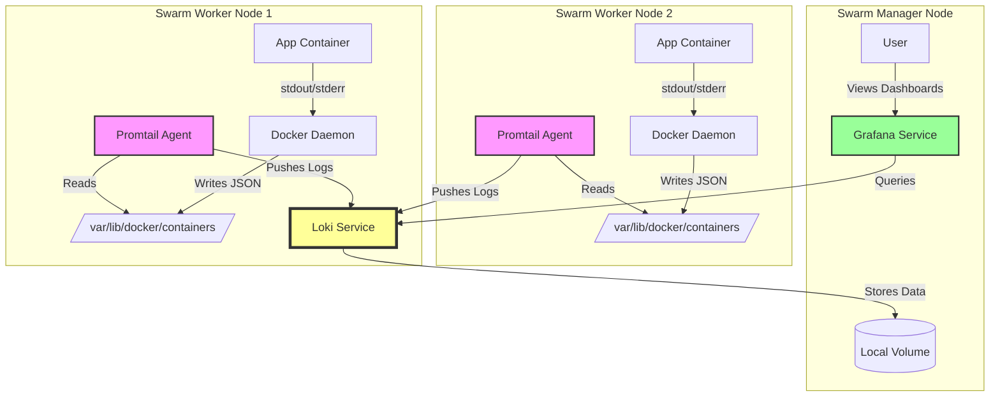

# Logging



## Key Architectural Decisions:

- Promtail (Global): Runs on every node to access that specific node's filesystem (/var/lib/docker/...).

- Loki (Pinned): Pinned to the manager node using placement constraints. This allows us to use a simple Local Volume for storage without needing complex NFS or S3 setups for a homelab.

- Network: All components communicate over a private overlay network (monitoring).

## Config

**Complete Docker Swarm Stack**

To keep your setup clean, we will use Docker Configs. This allows you to deploy the entire stack without manually copying configuration files to every single node.

Prerequisites:

Create a directory (e.g., monitoring).

Create the two config files below (loki.yaml, promtail.yaml) inside it.

Run the deploy command from that directory.

### Loki
Optimized for Homelab: Filesystem storage, TSDB index (modern/fast), and 14-day retention.

```sh
# loki.yaml
auth_enabled: false

server:
  http_listen_port: 3100

common:
  path_prefix: /loki
  storage:
    filesystem:
      chunks_directory: /loki/chunks
      rules_directory: /loki/rules
  replication_factor: 1
  ring:
    kvstore:
      store: inmemory

schema_config:
  configs:
    - from: 2024-01-01
      store: tsdb
      object_store: filesystem
      schema: v13
      index:
        prefix: index_
        period: 24h

storage_config:
  tsdb_shipper:
    active_index_directory: /loki/tsdb-index
    cache_location: /loki/tsdb-cache
    cache_ttl: 24h
  filesystem:
    directory: /loki/chunks

# Retention Logic (14 Days)
compactor:
  working_directory: /loki/compactor
  shared_store: filesystem
  compaction_interval: 10m
  retention_enabled: true
  retention_delete_delay: 2h
  retention_delete_worker_count: 150

limits_config:
  retention_period: 336h # 14 Days (24 * 14)
```

### Promtail

Optimized for Swarm: Automatically discovers Service Names and Stack Names.

```sh
#promtail.yaml
server:
  http_listen_port: 9080
  grpc_listen_port: 0

positions:
  filename: /tmp/positions.yaml

clients:
  - url: http://loki:3100/loki/api/v1/push

scrape_configs:
  - job_name: docker
    docker_sd_configs:
      - host: unix:///var/run/docker.sock
        refresh_interval: 5s
        
    relabel_configs:
      # 1. Keep only containers that have a name (filters out some internal noise)
      - source_labels: ['__meta_docker_container_name']
        regex: '/(.*)'
        target_label: 'container_name'
      
      # 2. Extract the Swarm Service Name (e.g., "mystack_nginx")
      - source_labels: ['__meta_docker_container_label_com_docker_swarm_service_name']
        target_label: 'service'
      
      # 3. Extract the Swarm Stack Name (e.g., "mystack")
      - source_labels: ['__meta_docker_container_label_com_docker_stack_namespace']
        target_label: 'stack'

    pipeline_stages:
      - docker: {}
```
### Docker compose

```sh
# docker-compose.yml
version: "3.8"

services:
  loki:
    image: grafana/loki:3.0.0
    command: -config.file=/etc/loki/local-config.yaml
    networks:
      - monitoring
    volumes:
      - loki-data:/loki
    configs:
      - source: loki_config
        target: /etc/loki/local-config.yaml
    deploy:
      mode: replicated
      replicas: 1
      placement:
        constraints:
          - node.role == manager
      resources:
        limits:
          memory: 4G

  promtail:
    image: grafana/promtail:3.0.0
    command: -config.file=/etc/promtail/config.yaml
    networks:
      - monitoring
    volumes:
      # Mount the Docker Socket so Promtail can find containers
      - /var/run/docker.sock:/var/run/docker.sock:ro
      # Mount the actual log files so Promtail can read them
      - /var/lib/docker/containers:/var/lib/docker/containers:ro
    configs:
      - source: promtail_config
        target: /etc/promtail/config.yaml
    deploy:
      mode: global
      resources:
        limits:
          memory: 200M

  grafana:
    image: grafana/grafana:latest
    ports:
      - "3000:3000"
    networks:
      - monitoring
    volumes:
      - grafana-data:/var/lib/grafana
    deploy:
      mode: replicated
      replicas: 1
      placement:
        constraints:
          - node.role == manager

networks:
  monitoring:
    driver: overlay
    attachable: true

volumes:
  loki-data:
  grafana-data:

configs:
  loki_config:
    file: ./loki.yaml
  promtail_config:
    file: ./promtail.yaml
```    

## Source References & Further Reading

- Loki Storage & Retention: Official guide on how the Compactor handles retention for local filesystem storage.

    Reference: [Grafana Loki Retention Documentation](https://grafana.com/docs/loki/latest/operations/storage/retention/)

- Promtail Service Discovery: Details on using docker_sd_configs to discover Swarm containers via the socket.

    Reference: [Promtail Configuration](https://grafana.com/docs/loki/latest/send-data/promtail/configuration/)
