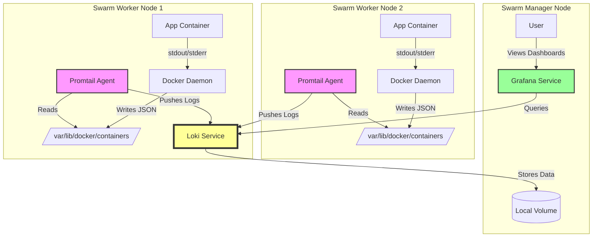

# Logging

## Local stack



### Key Architectural Decisions:

- Promtail (Global): Runs on every node to access that specific node's filesystem (/var/lib/docker/...).

- Loki (Pinned): Pinned to the manager node using placement constraints. This allows us to use a simple Local Volume for storage without needing complex NFS or S3 setups for a homelab.

- Network: All components communicate over a private overlay network (monitoring).

# Self-Hosted PLG Stack (Loki, Promtail, Grafana) for Docker Swarm

This setup is optimized for a 3-5 node homelab cluster. It keeps logs locally (filesystem), retains them for 14 days, and uses minimal resources (~2GB RAM total).

### 1. Architecture Overview

* **Promtail (Global):** Runs on *every* node to collect logs from `/var/lib/docker/containers`.
* **Loki (Pinned):** Runs on the **Manager** node. Using a placement constraint allows us to use simple local volumes instead of complex S3/Object storage.
* **Grafana (Pinned):** Runs on the **Manager** node for visualization.

### 2. Deployment Configuration

Create a directory (e.g., `monitoring`) and add the following three files.

#### A. `loki.yaml` (The Aggregator Config)
*Configured for local filesystem storage with 14-day retention.*

```yaml
auth_enabled: false

server:
  http_listen_port: 3100

common:
  path_prefix: /loki
  storage:
    filesystem:
      chunks_directory: /loki/chunks
      rules_directory: /loki/rules
  replication_factor: 1
  ring:
    kvstore:
      store: inmemory

schema_config:
  configs:
    - from: 2024-01-01
      store: tsdb
      object_store: filesystem
      schema: v13
      index:
        prefix: index_
        period: 24h

storage_config:
  tsdb_shipper:
    active_index_directory: /loki/tsdb-index
    cache_location: /loki/tsdb-cache
    cache_ttl: 24h
  filesystem:
    directory: /loki/chunks

# Retention Logic (14 Days)
compactor:
  working_directory: /loki/compactor
  shared_store: filesystem
  compaction_interval: 10m
  retention_enabled: true
  retention_delete_delay: 2h
  retention_delete_worker_count: 150

limits_config:
  retention_period: 336h # 14 Days (24 * 14)
```

### B. `promtail.yaml` (The Agent Config)
*Configured to auto-discover Swarm Service and Stack names.*

```yaml
server:
  http_listen_port: 9080
  grpc_listen_port: 0

positions:
  filename: /tmp/positions.yaml

clients:
  - url: http://loki:3100/loki/api/v1/push

scrape_configs:
  - job_name: docker
    docker_sd_configs:
      - host: unix:///var/run/docker.sock
        refresh_interval: 5s
        
    relabel_configs:
      # 1. Keep only containers that have a name
      - source_labels: ['__meta_docker_container_name']
        regex: '/(.*)'
        target_label: 'container_name'
      
      # 2. Extract Swarm Service Name
      - source_labels: ['__meta_docker_container_label_com_docker_swarm_service_name']
        target_label: 'service'
      
      # 3. Extract Swarm Stack Name
      - source_labels: ['__meta_docker_container_label_com_docker_stack_namespace']
        target_label: 'stack'

    pipeline_stages:
      - docker: {}
```

#### C. `docker-compose.yml` (The Stack Definition)

```yaml
version: "3.8"

services:
  loki:
    image: grafana/loki:3.0.0
    command: -config.file=/etc/loki/local-config.yaml
    networks:
      - monitoring
    volumes:
      - loki-data:/loki
    configs:
      - source: loki_config
        target: /etc/loki/local-config.yaml
    deploy:
      mode: replicated
      replicas: 1
      placement:
        constraints:
          - node.role == manager
      resources:
        limits:
          memory: 4G

  promtail:
    image: grafana/promtail:3.0.0
    command: -config.file=/etc/promtail/config.yaml
    networks:
      - monitoring
    volumes:
      - /var/run/docker.sock:/var/run/docker.sock:ro
      - /var/lib/docker/containers:/var/lib/docker/containers:ro
    configs:
      - source: promtail_config
        target: /etc/promtail/config.yaml
    deploy:
      mode: global
      resources:
        limits:
          memory: 200M

  grafana:
    image: grafana/grafana:latest
    ports:
      - "3000:3000"
    networks:
      - monitoring
    volumes:
      - grafana-data:/var/lib/grafana
    deploy:
      mode: replicated
      replicas: 1
      placement:
        constraints:
          - node.role == manager

networks:
  monitoring:
    driver: overlay
    attachable: true

volumes:
  loki-data:
  grafana-data:

configs:
  loki_config:
    file: ./loki.yaml
  promtail_config:
    file: ./promtail.yaml
```

### 3. How to Deploy

1.  Navigate to the directory containing the 3 files.
2.  Deploy the stack:
    ```bash
    docker stack deploy -c docker-compose.yml plg_stack
    ```
3.  Wait ~60 seconds for Loki to initialize.
4.  Access Grafana at `http://<MANAGER_IP>:3000` (User: `admin` / Pass: `admin`).

### 4. Post-Install Configuration

1.  **Add Data Source:**
    * In Grafana, go to **Connections** > **Data Sources** > **Add data source**.
    * Select **Loki**.
    * URL: `http://loki:3100`
    * Click **Save & Test**.
2.  **Verify:**
    * Go to **Explore**.
    * Select **Loki** from the top-left dropdown.
    * Run query: `{stack="plg_stack"}` to see logs streaming.
